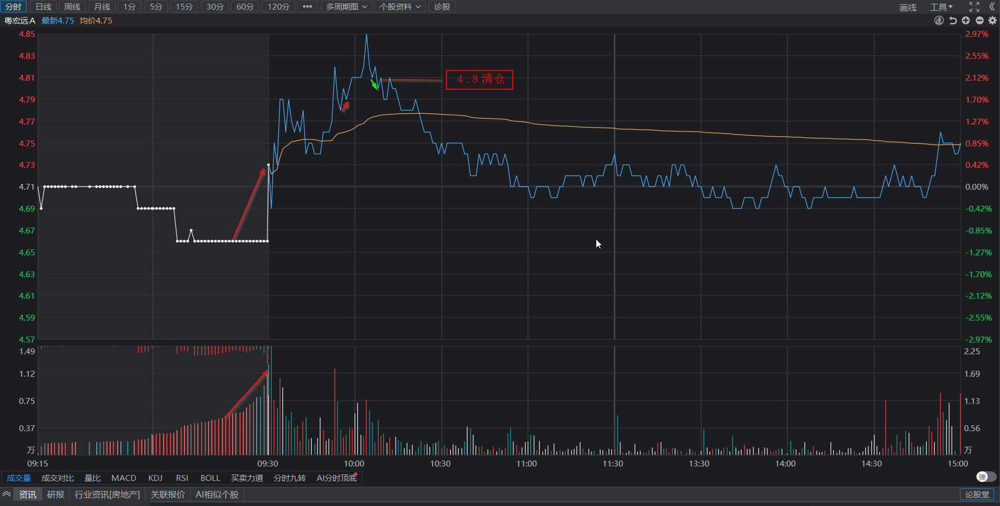

# 粤宏远冲高两点获利，金奥博冲高3点错失良机

## 一、持股复盘

### 1.粤宏远A

* **今日操作**  

  冲高两点套利清仓。  

  开盘竞价走弱，21分之后转强，竞价结束时抢筹拉升。 

  开盘后，1笔向上超过前中枢，上升走势很强，等待顶背离，第二次创新高后，分时向上结束，反弹处清仓。  
  

* **明日预期**

  已清仓。

### 2.深圳华强

* **今日操作**

  符合预期，5日均线止跌。当日最低价挂单未成交，匆忙在略高处抢筹。    
  华为发布会，公布5月份发布鸿蒙PC。  
  

* **明日预期**

  当前处于30分钟一笔下跌，日线处于5日均线附近。  
  预期不破5日线，缺口不完全回补。

* **非预期**

  补全缺口。

* **复盘分析**

  通过5分钟笔的底背离判断30分钟一笔下跌结束，应等待背离的一笔形成底分型后，1买买入。今日挂单最低价未买入后，略微心急，到收盘尚未形成底分型。

### 3.华联控股

* **今日操作**

  无操作。  
  
* **明日预期**

  仍处于30分钟中枢下沿，反弹到上沿4.27。

* **非预期**

  跌破30分钟中枢。

### 4.金奥博

* **今日操作**

  在分时线中枢加仓，未等跌破中枢后止跌。  

* **明日预期**

  目前处于5分钟一笔下跌。预期5分钟宽幅震荡，不破下沿。

* **非预期**

  跌破30分钟中枢。

* **复盘分析**  

  冲高后懵逼了，起了贪心。向上一笔结束后，应立即卖出，做T。  
  加仓点应该等跌破中枢，形成背离后加仓。

## 新股观察

### 1.长白山

* **原因**

  技术形态好 + 旅游季 + 提振消费。

* **明日预期**

  3月19日：30分钟回调至20均线后延续上升走势。  
  今日跌破20均线，继续观察5日均线止跌。沿5日均线向上。

* **非预期**

  跌破5日均线。

### 2.渤海化学

* **原因**

  技术形态好。

* **明日预期**

  当前多周期共振向上。  
  30分钟回落到20均线后继续向上。

* **非预期**

  跌破30分钟20均线。

### 3.中科金财

* **原因**

  技术形态好 + AI智能体 + 算力 + 鸿蒙

* **明日预期**

  当前多周期共振向上。  
  30分钟回落到20均线后继续向上。

* **非预期**

  跌破30分钟20均线。

### 3.舍得酒业

* **原因**

  技术形态好 + 板块共振

* **明日预期**  

  10日线之上止跌企稳。白酒板块当前处于10日线，止跌。

* **非预期**

  跌到10日线未止跌，同时白酒板块跌破10日线。

### 4.广百股份/友好集团/来伊份

* **原因**

  技术形态好 + 消费

* **明日预期**  

  止跌向上。

* **非预期**

  跌破30分钟中枢未发生底背离。