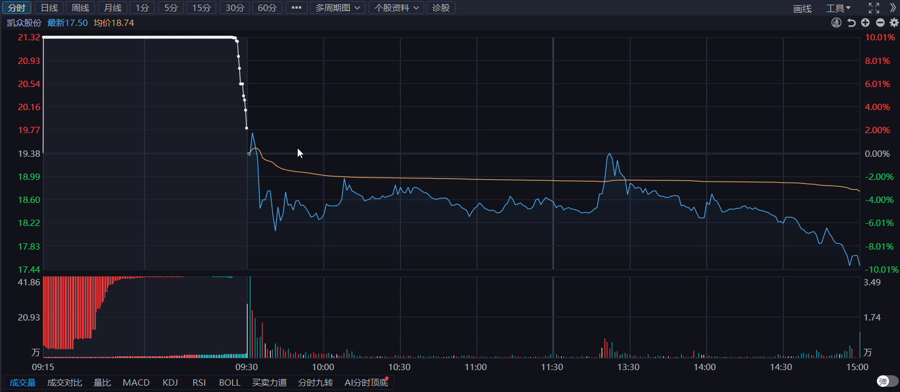
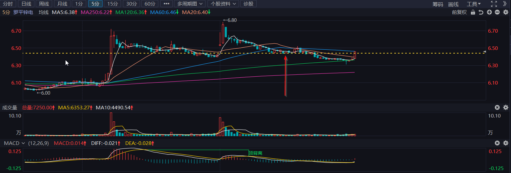

# 失败与成功并存

## 2025-03-03 星期一

### 交易总结

- **拓维信息**

  - **今日操作**
    清仓卖出，没有按计划卖出。交易失败
  - **买入回顾**
    30分钟macd即将反转，待macd变红后，观察30分钟滞涨，结合5/1分钟顶背离卖出。

- **凯众股份**

  - **今日操作**
    清仓卖出，集合竞价强转弱，竞价卖出。交易成功。
  - **买入回顾**
    30分钟macd即将反转，待macd变红后，观察30分钟滞涨，结合5/1分钟顶背离卖出。
    

- **金奥博**
  - **今日操作**
    追涨停板。  
  - **买入回顾**
    民爆龙二，龙一应该是保利联合。

- **罗平锌电**
  - **今日操作**
    半仓买入。  
  - **买入回顾**
    周，日级别技术形态好，题材方面金属材料为固态电池原材料。买入点中规中矩, 应结合大盘，5分钟跌破前低，形成底背离买入。
    

### 复盘总结

- **今日操作总结**:
  - **总结1**: 应按照自己的交易理念进行交易，等待交易机会，不要操之过急，不要受其他博主影响。
  - **总结2**: 坚定理念，果断交易，不到自己的判断位置，不交易，继续空仓或者持仓。

- **明日计划**:
  - **金奥博**
    关注集合竞价，进行交易。同时关注民爆概念强度，保利联合与进奥博龙头之争。
  - **罗平锌电**
    当前5分钟向上，看能否转化成30分钟止跌反转。如果走势不明确，盘中根据5/1分钟级别做T。