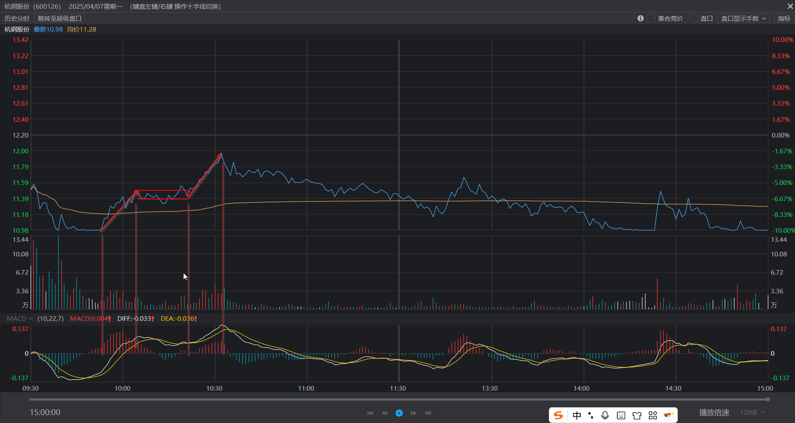
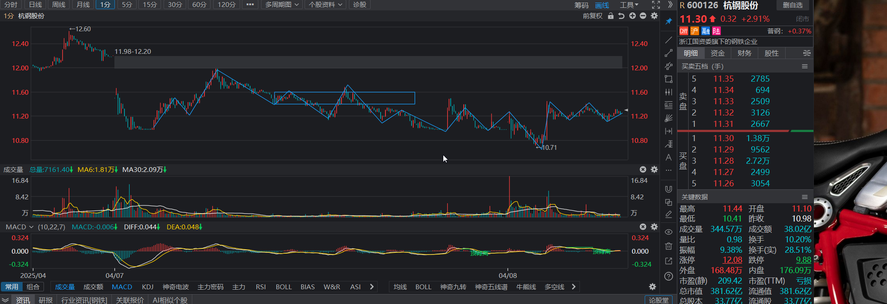
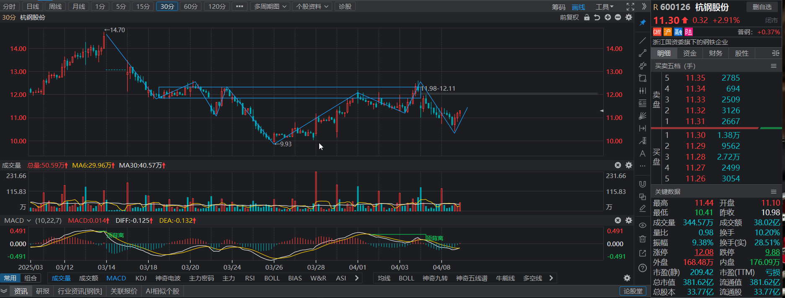

# 与周一犯同样的错, 非常煎熬

## 一、持股复盘

### 1.杭钢股份

* **复盘**

​	**周一04-07**分时顶背离未出, 而后节奏乱掉. 如图, 股价新高后, macd面积明显缩小.

​	

​	

​	复盘发现, 之后的反弹进入中枢后, 靠近上沿仍有多次二卖/类二卖点.

​	

* **今日操作**  

  清仓换股.

* **明日预期**

  当前处于30分钟向上走势中枢里 。
  
  如果价格向上离开中枢, 关注顶背离.
  
  如果价格向下离开中枢, 则延续日线下跌, 关注与进入笔的底背离.
  
  
