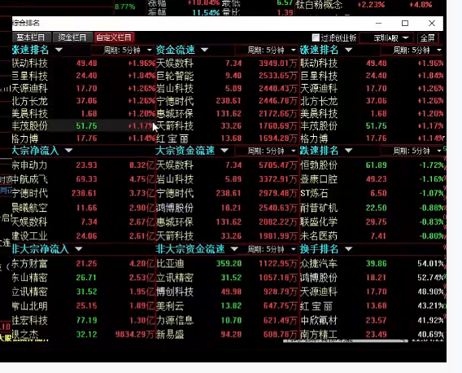

# 5月7日情绪流孤舟直播

参考如下链接, 当前关注核心题材为化工原料, AI, 人形机器人.
https://www.tgb.cn/a/2hMyxYTehpj

> 1.如何分辨带动性和主动性? 
> 5月7日化工原料中渝三峡A最早涨停上榜, 但没有其他化工股跟上, 只能说明主动性好. 随后红宝丽涨停上榜, 其他化工股跟上, 这就是带动性.
> 
> 2.如何划分AI和算力?
> 人工智能大体分为AI应用, 算力, 数据中心. 关注核心股价即可.
> 算力有大位科技, 海南华铁, 杭钢股份
>
> 3.学会空仓不参与
> 行情不好不参与. 
> 分析个股要拉升, 但市场行情差, 也可以不参与. 比如3,4月分钟不参与, 就能超过70%的人.
>
> 4.看盘如何专注哪一个板块?
> 比如侧重AI板块, 就重点观察AI的几个股, 机器人个股关注一两个就行了.
>
> 5.看涨速还是涨幅?
> 5分钟净流速看板块. 5分钟涨速看个股.
> 比如板块净流速大, 再看涨速快的个股是否属于这个板块, 如果属于, 就是共振, 说明主力在引导. 
> 
> 同花顺81看涨速排行.
> 
> 
>
> 6.怎么复盘?
> 看别人的复盘, 结合自己的分析, 觉得哪些是对的, 加上自己的理解.
>
> 7.当前交易纪律
> 不买军工, 半导体, 光伏, 医疗.
> 没有潘行长参加的会议不参与, 有潘行长参加的会议高开必卖.
> 不做二波.
>
> 8.什么市场量能要做
> 放量过万亿就做, 不过万亿有利好也不做.

1. 化工原料  

中欣氟材 渝三峡A 先达股份 中毅达 红宝丽 红墙股份

* 选股思路: 量价齐升, 虽然不是涨停, 但受市场认可.
* 风险: 缩量加速时.
* 强势股: 中毅达 红宝丽换手率高, 能走到最后.

2. 算力  

机器人反复折磨, 虽然涨的不错, 但赚不到钱, 也不算好板块.   
算力趋势明显, 容易赚钱.

* 大位科技, 龙头, 5月6日减持等利空下, 资金拉涨停, 很亮眼. 
  * 5月7日高开点数少, 身为龙头开盘弱, 带动整体不及预期. 
* 海南华铁, 价格已经到达前高, 资金仍然无所畏惧的聚焦, 亮眼.
* 杭钢股份

3. 机器人

机器人概念不断扩散, 当前扩展到汽车零部件, 未来可扩展性也很大.
