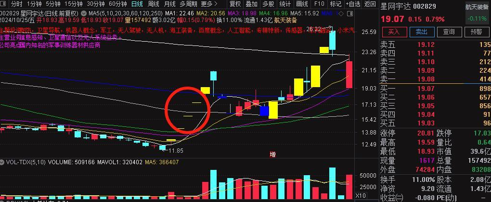
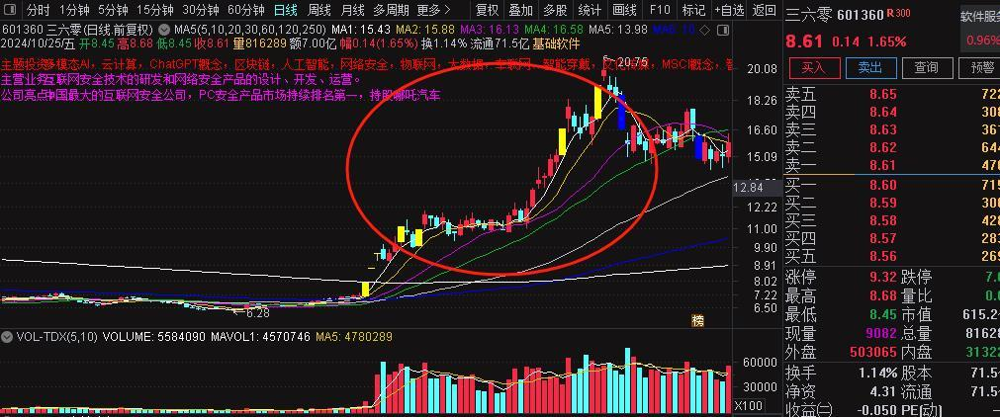
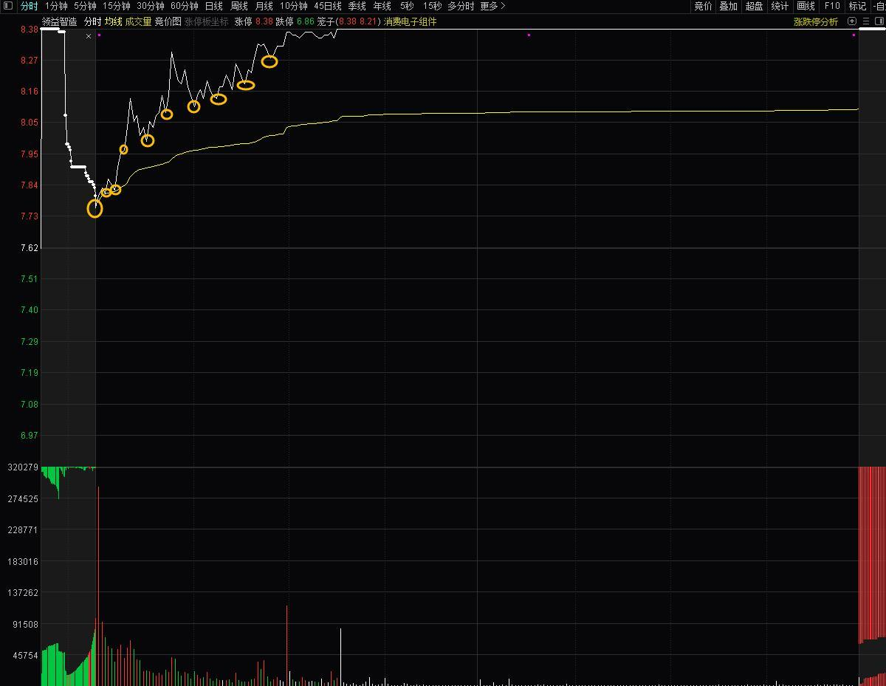
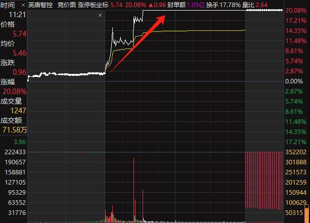
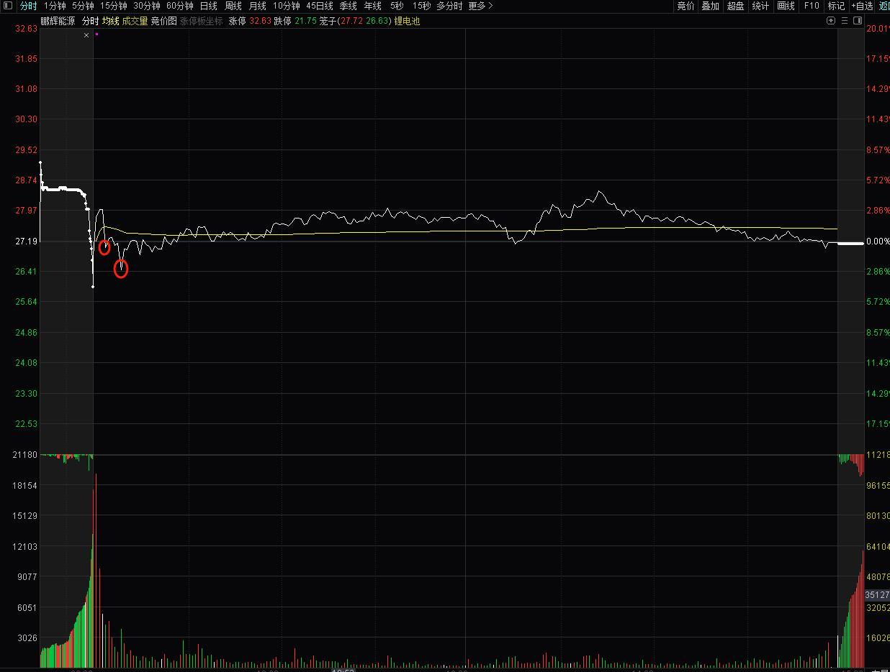
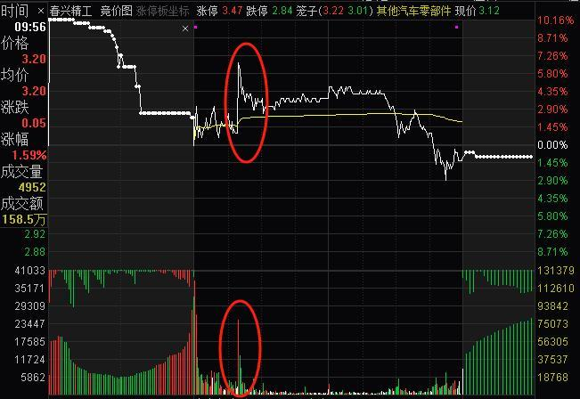
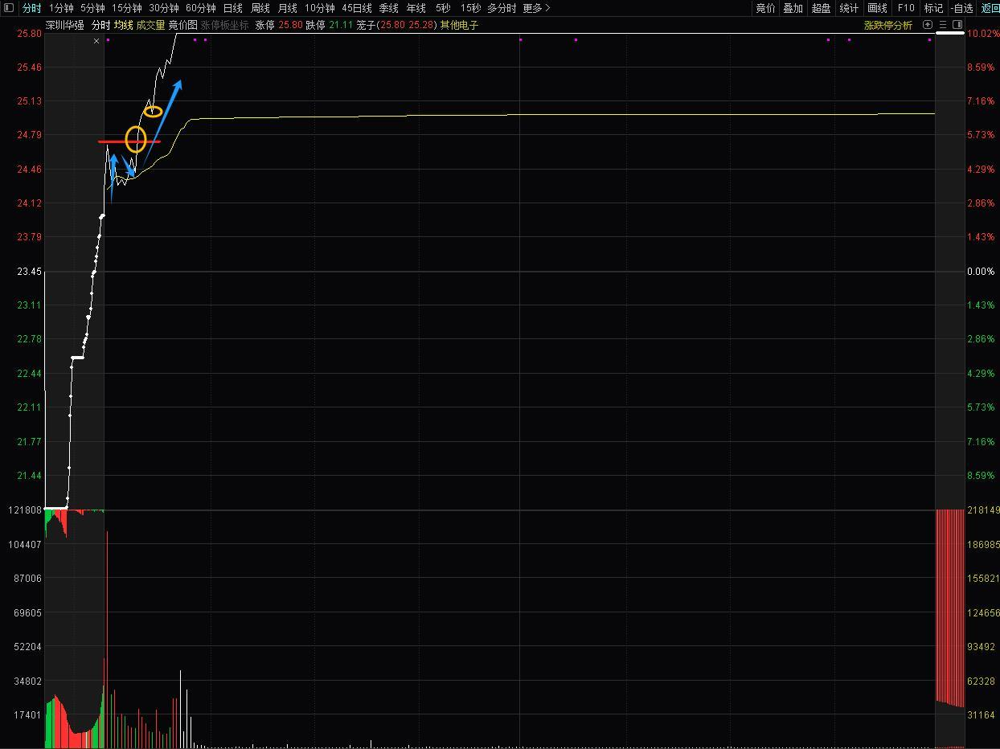
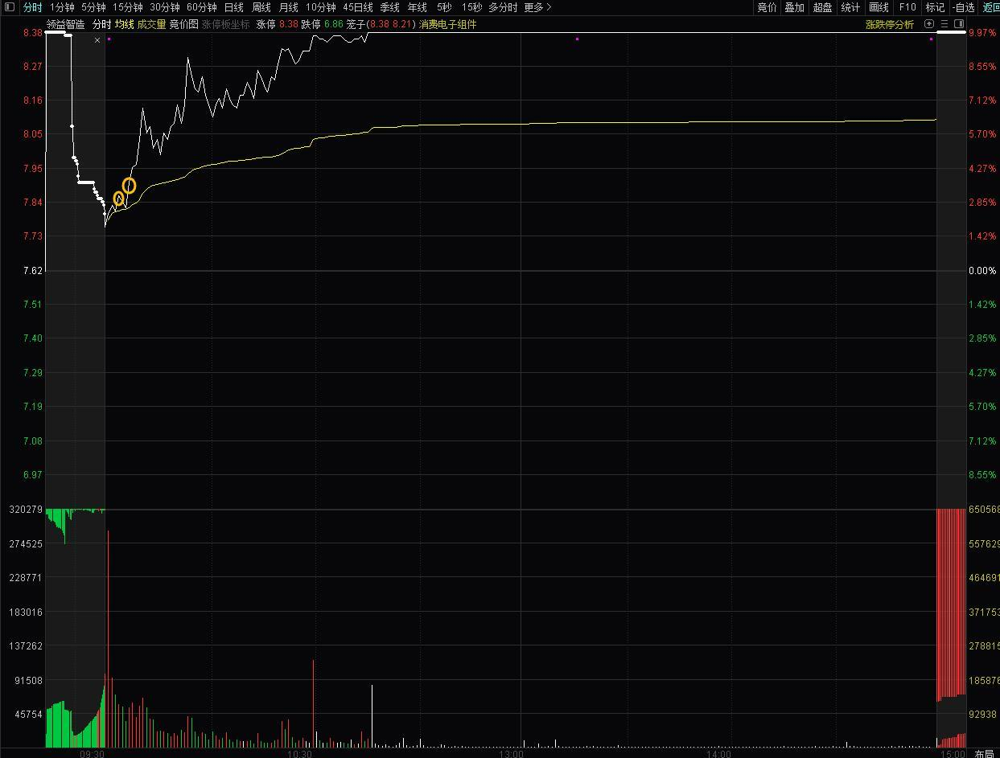

> [!note] 
>
> 该文档整理自淘股吧_此战名天下技术贴. 
>
> [此战名天下: 超级实战干货](https://www.tgb.cn/user/blog/blogcata?userID=9620219&bcID=41132)

## 一. 如何聚焦主线题材

### 1. 前言

炒股之所以要炒主线, 就是为了站在风口上, 顺应趋势而为！因为市场的资金聚集在风口方向, 这个时候如果你进击其它方向, 那就好比战场上脱离了大部队, 大概率没有好下场. 

### 2. 如何判断主线  

* **足够的爆发力**

主线启动, 必须经历一次大规模的爆发, 爆发的当天日内涨幅全市场第一, 并且
这个方向满屏涨停的公司. 

比如9月24日, 大金融方向近30家公司涨停, 爆发力拉满！

* **队伍要强悍**

单纯爆发那么一两天, 可能只是昙花一现, 所以光短期的爆发力还远远不够的！好比打一场持久战, 需要强悍的三军, 真正的大主线亦是如此**, 前锋. 中军. 大部队一个都不能少！**

**①.前锋是方向爆发后超级大单的一字的公司**, 它们越强. 越多, 代表这个方向非常热门. 比如下半年比较热门的几个主线方向, 无人驾驶题材的星[网宇达. 锦江在线]()；大金融题材的[天风证券. 国海证券. 中粮资本](), 大金融有好几个一字；鸿蒙软件题材的[常山北明. 润和软件](), 都是代表这些方向的前锋；

**②.中军是大市值. 大成交容量的公司, 他们是这个方向的定海神针, 真正有价值的公司**, 比如以前电商时代, 蘑菇街. 美丽说非常火, 但真正还是得看[阿里巴巴](), 只有它才是这个行业的风向标；再好比去年炒人工智能大模型, 真正能跑出来的也就是[百度. 360. 阿里]()这些, 所以当时360是那个题材的中军；这次鸿蒙方向的[常山北明. 润和软件](), **既是先锋龙头, 又是行业中军**, 因为鸿蒙题材的范围比较小, 真正受益的公司屈指可数！

**③. 大部队**就不解释了, 无外乎就是**后排跟涨**的部队, 只是烘托这个方向, 跟风涨一涨, 不具有代表性. 

* **故事（题材）推动性**

一个真正的大主线，故事必须有推动性、想象力，如果这个风口没有想象力，行情走不了太久就会被证伪，比如去年的人工智能、今年的低空经济、无人驾驶，之所以诞生了超级大龙头，并且经历了好几个炒作阶段，就因为题材的想象空间大，政策对故事的推动性比较大。

**所以当题材强势启动，并且队伍强悍的时候，我们要做足功课，看看未来一段时间，有没有密集的政策推动题材发展，查询各个软件，看看未来有没有相关的行业会议；题材是不是朝阳产业、未来产业，蓝海方向，或者是基本面大幅扭转！**

### 3. 如何聚焦主线

如果明确主线后，我们的交易就要围绕主线来做，无外乎**围绕情绪先锋龙头+中军趋势龙头来操作**，主线、龙头不言顶，**当没有完全结束，禁止参与低位题材**，尤其是当主线一阶段涨完盘整的时候，底部题材得到轮动的机会，但是如果你立马掉头玩底部题材，那非常可能被甩下车，**只有当高位主线完全大势已去，明显退潮后，我们才专注于底部新主线！**

## 二. 实战大龙头, 银之杰的确定性买点教学

> [!Tip]  
>
> **1.一些术语:**
>
> | 术语     | 白话释义            | 定义                                                         |
> | :------- | :------------------ | :----------------------------------------------------------- |
> | 预期差   | 就是预期的涨跌幅度. | 预期差是指市场参与者对某一事件、数据或资产价值的**预测结果与实际发生情况之间的差异**.  预期差反映了市场共识（如分析师预测、投资者情绪）与最终结果的不匹配。当实际数据高于预期时称为**“超预期”**，低于预期则为**“不及预期”**。 |
> | 套利预期 | 就是预期会获利.     | 套利预期是指投资者基于市场上存在的价格差异或潜在的价格波动，通过分析相关资产之间的价差变化趋势，预先制定交易策略以**捕捉低买高卖**机会的投资行为. 通过预测价差回归均衡的过程**实现盈利**. |
> |          |                     |                                                              |
>
> 

### 1. 买点一：买入龙头之预期差

新龙头早期的脱胎都是有迹象的，通常当市场的老龙头步入晚年，新龙头就呼之欲出了，就好比暮年快要退位，阿哥们就有了当的预期！股市亦是如此，当龙头资金对老龙头没什么期待了，就会寻找新的对象来扶持其登基，这里低位的潜力明星就产生了当龙头的预期差，此时你需要找到这几个有能力当的阿哥，第二天站队正确，九子夺嫡只有一个胜出，一定要有眼力甚至火眼金睛！

老龙头保变电气，9月23号是高位连续加速的第二天，虽然这两天都是加速，但是有本质区别，22号缩量一字板是比较强的，23号虽然还是加速，但已经放了点量，这就有了走弱迹象！当然放的量还不够，那么预判24号仍然会走个缩量的加速板，因为如果不能加速迅速锁住抛压会直接挂，但即使这个缩量加速也不能再去了，因为你不知道会不会在板上兑现！这也说明保变电气已经暮年了！

所以23号晚上的复盘，我们给出的策略是，保变电气不能去，而常山北明更像承上启下的定位类似成吉思汗，也是加速中暮年之躯，而**预期差在20CM**(下边图片详解)，备选股：银之杰、法本信息，也给出了可以干的条件；

**我们回顾24号的盘面走势，是不是符合剧本：**

* 银之杰弱转强承接，诞生买点

* 法本信息开盘主卖为主，虽有承接，但是换手买量较小，套利预期弱，优先身位更高的银之杰

* 保变电气缩量加速，然后被砸

* 常山北明缩量加速，然后被砸

### 2. 买点二：关注逻辑之超预期

老龙保变电气下位后，新的阿哥银之杰，是否名正言顺？还是趁机偷袭的陈友谅，只是外强中干？我们需要分析它有没有更深的逻辑，有没有超预期？

* 在25号，我给大家分享了银之杰成为大龙头的深度逻辑

* 银之杰有深度逻辑支撑，当天盘中再次出现超预期的买点，表现在大金融的前排核心弘业期货中午出现负反馈，而银之杰出现回流超预期；
* 25号弘业期货负反馈，银之杰强势迅速回封，取代弘业期货，在大金融中成为前排一哥，这是第二次买点；

### 3. 买点三：龙头明牌之强分离

虽然25号，银之杰成了大金融前排龙头，但是大家对大金融的预期始终怀疑，毕竟一方面熊市太久了，被券商渣男搞怕了，万一券商第二天又来渣我们呢？是不是？并且25号常山北明是非常超预期的涨停，市场对鸿蒙软件抱有非常高的预期，银之杰也是有华为软件题材，接下来银之杰想明牌走大金融，就比如把常山北明的地位PK下去，完成强分离；

我们看市场剧本：26号常山北明被砸大跳水，银之杰被带下去后承接，强势换手完成分离，分离后就是银之杰的第三买点；

### 4. 买点四：龙头转强之首加速

龙头明牌后的第一次加速，这也是龙头明牌后的弱转强，如果能承接住也是一次确定性的买点，最差预期也是第二天在极端加速后才分歧

### 5. 买点五：头铁之反人性买点

一般对于主板龙头，在明牌加速的买点后，后边还有头铁的买点、反人性的买点；但是对创业板而言，这是最后一次确定比较大的买点，后边再加速就不好接了，毕竟高度已经200%了，正常是要分歧转趋势的！

当然市场没有唯一性，现在又是牛市预期，涨出500%也不是不可能，但是一口气还是难的，不过我们炒股做大概率的事情；

------

虽然说龙头上涨途中，任何一刻都是买点，但其实真正标准的确定性买点就是以上内容，我都给大家否分享出来，大家好好学，市场中没有人能完全把握每一个确定性买点精准买入，但是这些干货能让你学会方法，即使第一买点没上去，后边也能随时把握盘面风向，把握之第二、第三买点进行补票上车.

## 三. 手把手教你设置顶级看盘界面

[超级实战干货，手把手教你设置顶级看盘界面](https://www.tgb.cn/a/2bKEmaF5ldF)

TODO: 

1.电脑平时用同花顺远航版, 战师所用通达信不适应. 但是里边讲的看哪些指标非常有意义, 等自己能把握时再进行设置.

2.主用手机炒股, 电脑版面暂时无用.

3.目前水平不够, 理解不了看那么多参数的意义, 自己也没能力关注那些, 因此咱不修改看盘界面.

## 四. 手把手教你判断分时承接的强弱，形成买入点

> [!note]
>
> 分时图与日K线原理相同, 怎么看日K线就怎么看分时图，并且同样也遵守量价关系，比如量价齐升是健康的分时走势，缩量拉升就是一种量价背离，表明股价在走日内的加速，一旦分歧就容易爆量拐头向下，所以与日K线是相同的含义。

### 1. 分时承接怎么看

* 分时在**均线上方**运行，回踩不破均线，即使**跌破能迅速拉回均线**上方，并且低点不断被抬高，一浪比一浪高，整体趋势向上.
* 以**开盘价**为锚点，分时价不能有效跌破开盘价，分时如果有效跌破开盘价，说明股价出现拐头向下的趋势，这就是承接弱的表现，注意是有效跌破，也就是**跌破后迅速且有力拉回**也勉强可以，但是肯定不如全天在开盘价上方运行承接强.
* 全天**均线和分时**基本在红盘以上，也就是**零轴上方**，因为一只强势上涨的股票，股价正常逻辑是一路向上，如果分时全天在水下运行，说明当前股价比昨天的收盘价还低，不是承接强的表现

例如周五[领益智造]()，分时全天在红盘以上，开盘后虽然略微跌破开盘价，但能迅速拉回上方，并且股价在均线上方运行，分时低点不断抬高，这就是承接强的表现

同样例如周五的[英唐智控]()，开盘价4.90，全天未破开盘价，一路震荡向上至涨停，这就是全天强势承接的表现

而周五的[鹏辉能源]()，开盘上冲后，股价回落均线下方，甚至回落到水下，分时低点不断降低，并且股价前半个小时一直在绿盘，这就是承接弱的表现

### 2. 分时承接还要关注成交量

也就是前面提到的量价问题。如果单从走势图判断，并不能精确反应承接是不是真实的强，有部分票分时走势看着比较强，但本质是量化引导的，盘口成交量很稀疏，这种承接其实是外强中干。

* **密集量成交承接强，稀疏量成交承接弱**

稀疏量成交说明这个股人气差，没有大资金维护盘面，这样的股往往出现冲高回落的情况，具体可以看盘口分笔数判断，一般单位时间笔数低量小，比较稀疏；密集量成交量说明人气高，那么成交量比较大，有人主动卖出，就有人主动买入，成交量密集，这种承接性更有效。

* **量价齐升承接强，急拉缩量承接弱**

有的票分时急拉5个点，但是量能迅速萎缩了，这种千万不能追。因为买盘跟不上，承接就走弱了，真正承接好的走势，是盘口持续有大单主动去买入维护股价，量价齐升。

例如[春兴精工]()，急拉后出现抛盘，随后成交缩量，这种不是强势承接的表现，反而是主力诱高卖出

比如周五的[博士眼镜]()，上午的一波拉升是带量的，但是回落后下午的再次拉升已经没有量了，这就是典型的量价背离，这里就是一个卖点；

### 3. 超短实战中，我们如何根据分时承接的强弱，形成买入点？

* 我们讲的超短线的干货，因此选择的股票**主要针对核心股、龙头股**；

* 市场全天的成交量大部分集中在早盘，所以早盘前几分钟的承接，基本决定了全天承接，如果开盘后迅速承接走强的那一刻，那么就是股票的买点；

例如周五的[深圳华强]()，竞价爆量弱转强，开盘冲高回落不破开盘价，企稳后再次上冲破第一个高点，就是承接走强的体现，这里就是比较有确定性的第一个买点；

[领益智造]()，开盘后第一笔拉升回落不破均线，再次上冲突破前高点，就是承接走强后第一个最佳买点，往后连续走强都是买点，但肯定不如第一买点性价比高，所以我们分时一旦走强，决策要果断，这也是超短客必备的素质

