## 基础

### 顶底分型

* 顶分型：k线1到2，高点上移，低点上移；k线2到3，高点下移，低点下移。k线3收盘低过k线1，能量最强。

* 底分型：k线1到2，高点下移，低点下移；k线2到3，高点上移，低点上移。k线3收盘高过k线1，能量最强。

* 包含处理：向左合并。顶分型取高高，底分型取低低。

### 笔

中间的k线可以比底分型高。

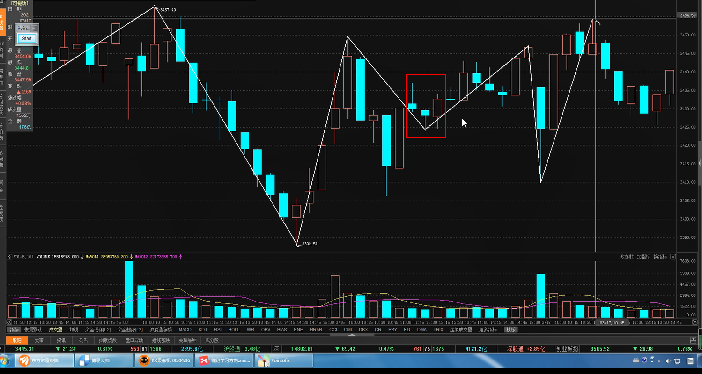

## 中枢

【缠论中枢的生长方式：中枢新生，中枢延伸，中枢扩张，中枢扩展✅ 一个视频全部讲透】https://www.bilibili.com/video/BV1otUUYZEug?vd_source=1679980dc710f38d5c49515d0c297073

> [!note]
>
> 1. 中枢区间由行成中枢的**前三笔**构成，上沿取次高，下沿取次低，即交集。
> 2. 中枢扩张后行成更大级别的中枢，即盘整走势，而非趋势。中枢扩张说明不确定性和复杂性加大。向上扩张，意味着向上的力量衰竭，需要继续蓄势，向下则反之。中枢扩张一般用同级别分解+走势生长来应对，实在不会就换个看的懂的。

### 中枢新生

* 中枢新生，两个中枢的价格没有重叠。

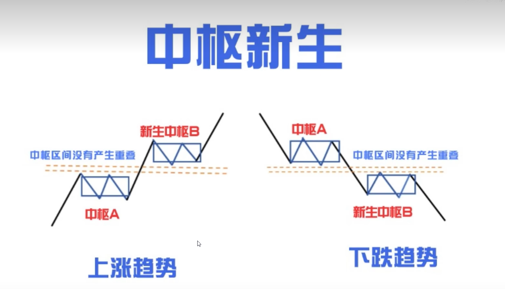

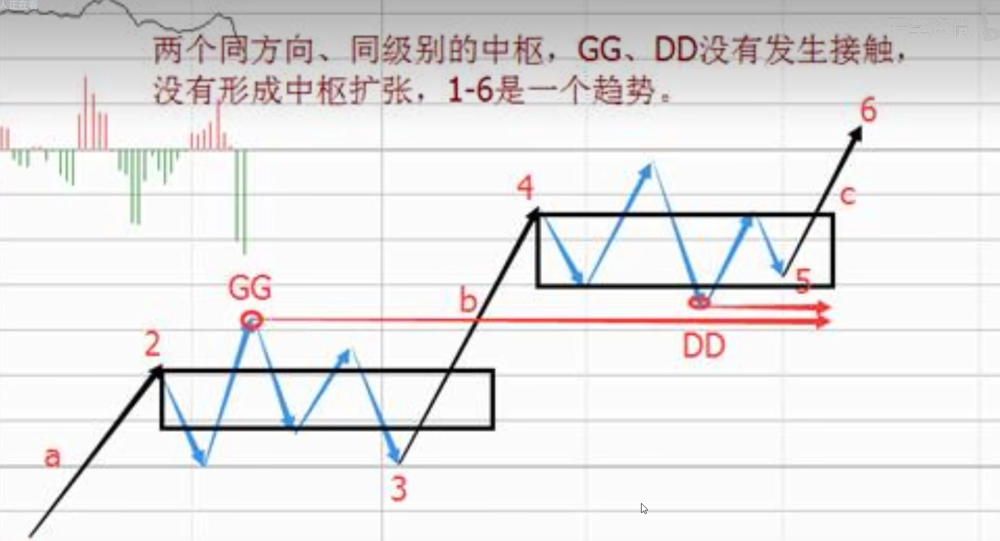

### 中枢延伸

* 延伸少于9笔也叫延伸。

* 延伸达到9笔中枢升级为高一级别的中枢。

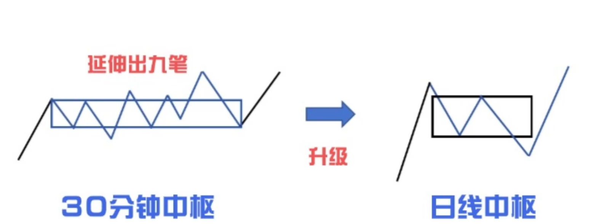

* 中枢区间由前3笔重叠部分构成。

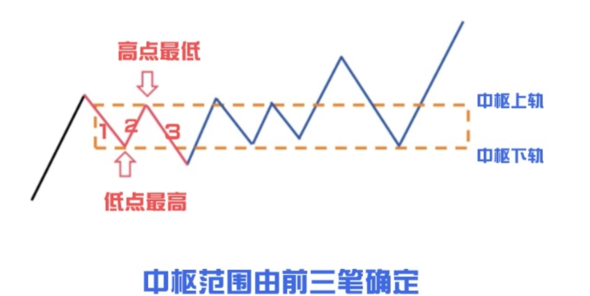

* 中枢延伸浪费时间，应等待3买出现介入。

### 中枢扩张

* 行成同向同级别第二个中枢后，价格有重叠。
* 中枢扩张后行成更大级别的中枢，即盘整走势，而非趋势。中枢扩张说明不确定性和复杂性加大。向上扩张，意味着向上的力量衰竭，需要继续蓄势，向下则反之。
* 中枢扩张一般用同级别分解+走势生长来应对，实在不会就换个看的懂的。

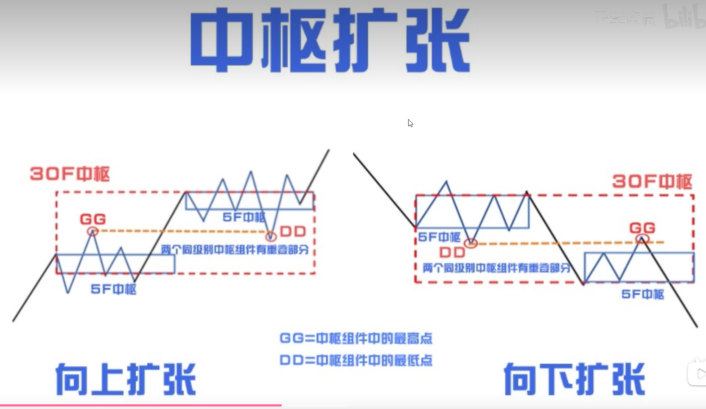

### 中枢扩展

* 第一个中枢形成后，形成了次级别的第三类买卖点，之后又回到了中枢区间。

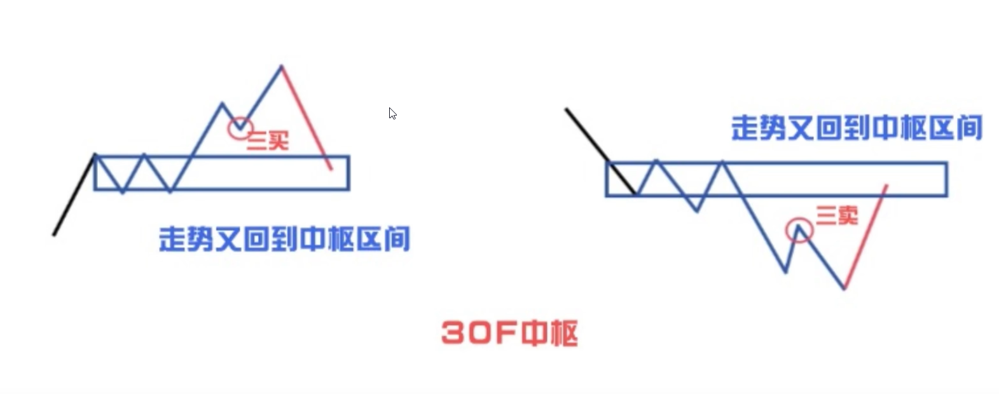

* 离开中枢后，价格回到中枢笔的价格高点，但不回到中枢区间，当成三买处理，不是扩张。

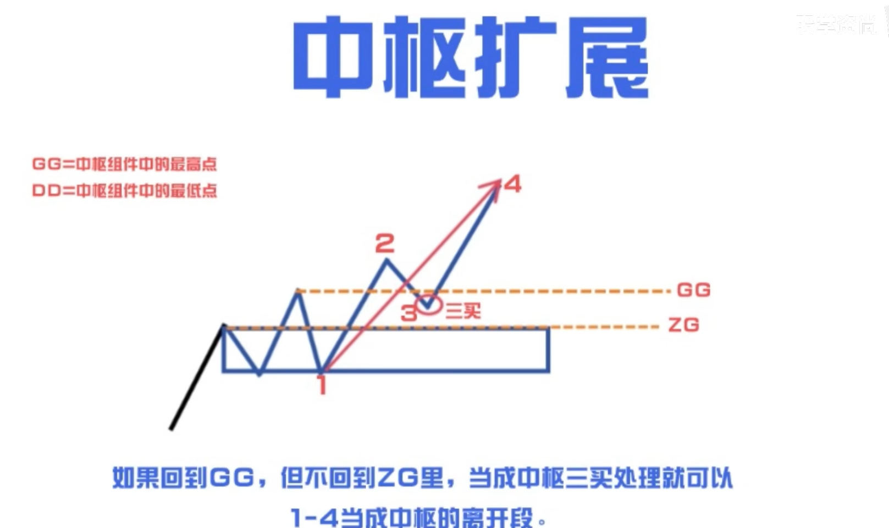

* 中枢扩展不一定行成中枢升级，走出3-4行成3个线段，中枢才升级。

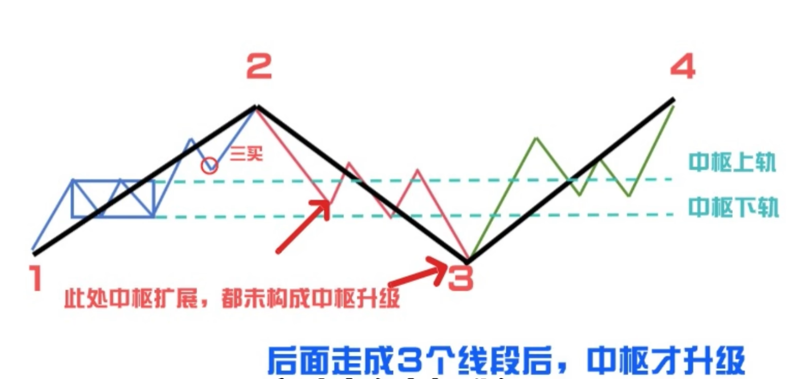

* 中枢扩展采用同级别分解应对每一段走势，左边当做完成的走势类型，只关注右边即可。也可以看不懂就不做了。

### 中枢扩展和扩张的区别

* 中枢扩张是行成第二个同级别同向中枢后，才会发生。因此行成第二个同级别同向中枢前，只需要考虑扩展。

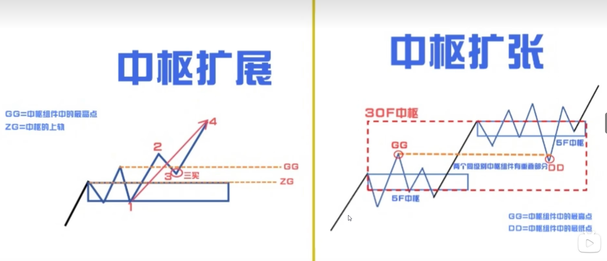

## 缠论背驰

【干货！缠论背驰的4种方法，一个视频全搞懂！】https://www.bilibili.com/video/BV1kZiBY5EoM?vd_source=1679980dc710f38d5c49515d0c297073

### MACD背驰

* 价格和MACD量能反向

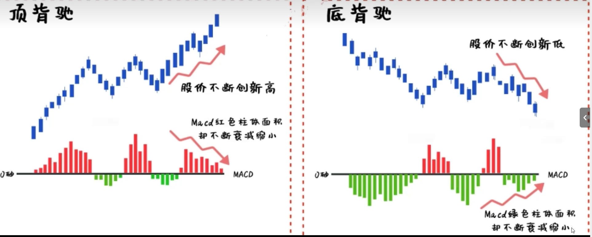

### 中枢背驰

* 离开段对应MACD面积相比进入段明显缩小，且黄白线不低于前边。
* 前边构成中枢时，**必然**有MACD**黄白线拉回零轴附近**的动作。一般出现双次拉回，都没有拉回**零轴以上**的，必然会有再次下跌。

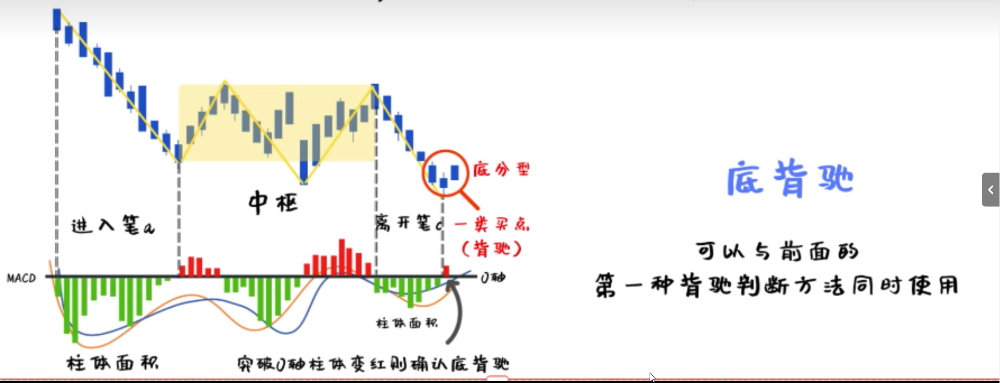

### 盘整笔背驰

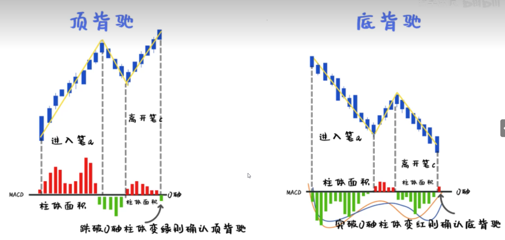

### 趋势背驰

* 离开笔c和进入笔a中间有一个中枢，否则就是盘整背驰。离开笔c对应面积相比进入笔a明显变小，顶背离。
* 日线级别以上出现趋势背驰，都是阶段性顶底部，一买一卖确定性很高。

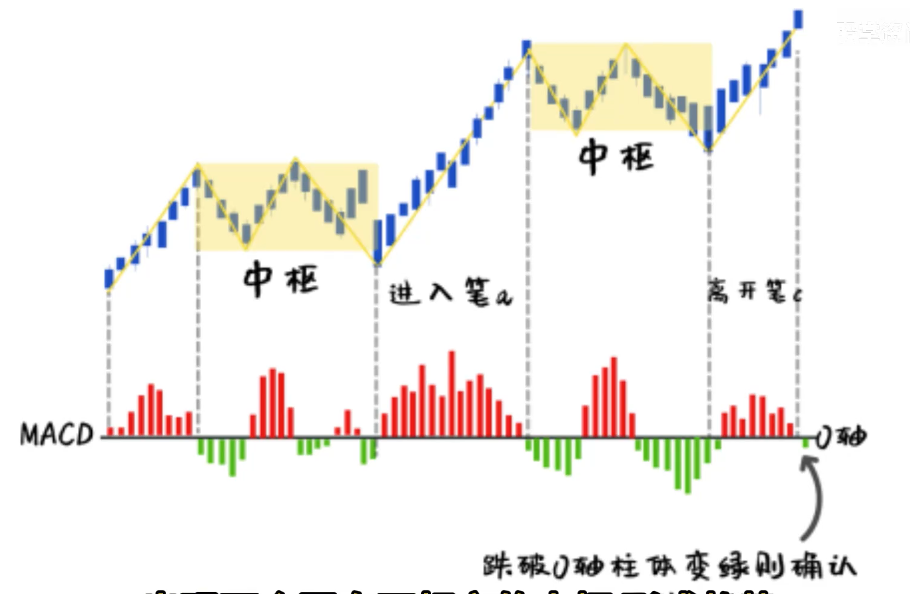

## 缠论交易模型

【缠论中小资金最高效率的买入模型，终于有人讲透彻了 ！】https://www.bilibili.com/video/BV1YxrgYcE8y?vd_source=1679980dc710f38d5c49515d0c297073

* 中小资金利用率最高的是下跌盘整下跌。在下跌走势中，1买后出现盘整，要立即离场。
* 一买在中枢下方，图中A，B都是1买，A是绿色圆圈圈住的地方。
* A点一买之后，反弹并未行成中枢下轨的突破，再构建一个顶分型走震荡，过段离场。

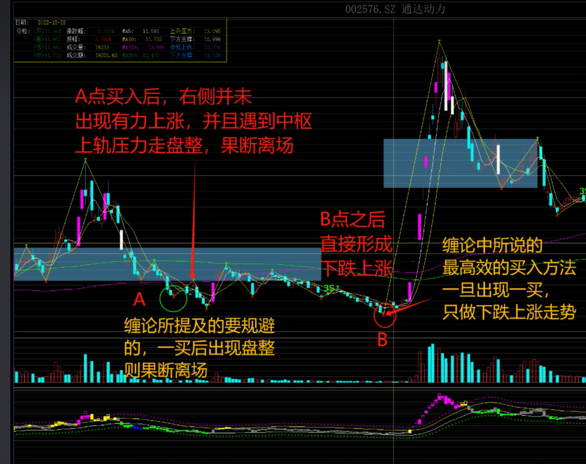

## 同级别分解

【缠论走势连接的同级别分解，学会轻松把握买卖点！】https://www.bilibili.com/video/BV1tDw2eGEgu?vd_source=1679980dc710f38d5c49515d0c297073

固定一级别进行操作，把走势分解为下跌、盘整、上涨进行连接，目的是简化分析，永远只需要处理一个正在完成的中枢，无需顾及之前走势的影响。

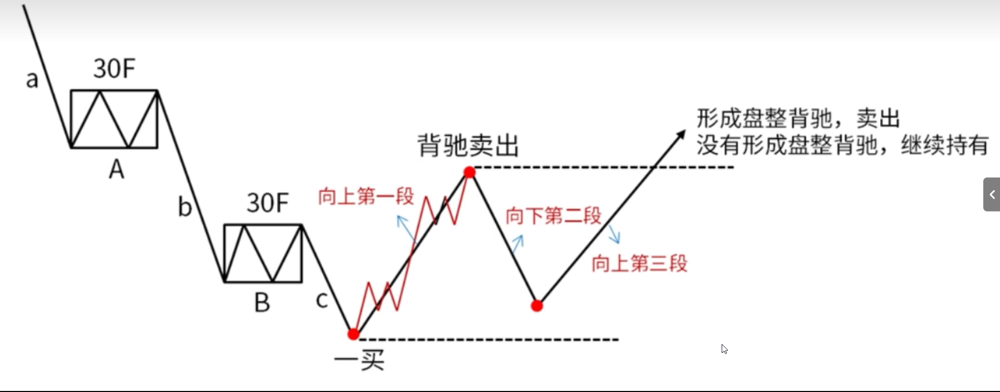

* 日线级别，盘整后，地背驰买入。次级别发生盘整背驰卖出。

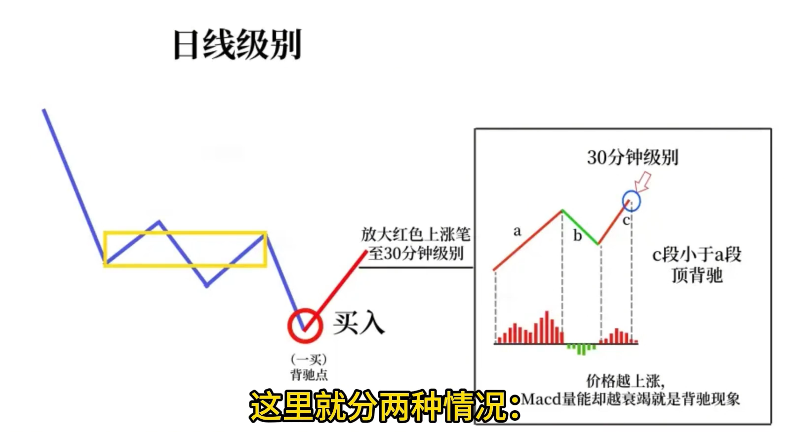

* 第二笔回调

1. 不跌破前低，次级别发生盘整背驰，本级别出现底分型，2买买入。

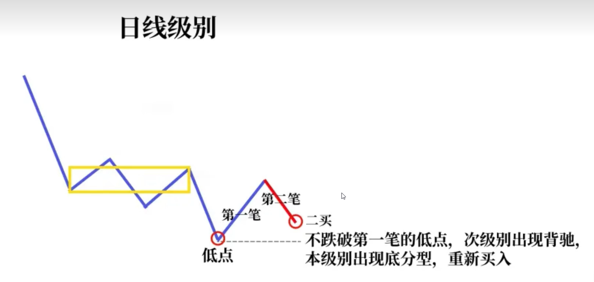

2. 跌破前低，与第一笔前的下跌笔笔行成盘整背驰，本级别出现底分型，重新买入。

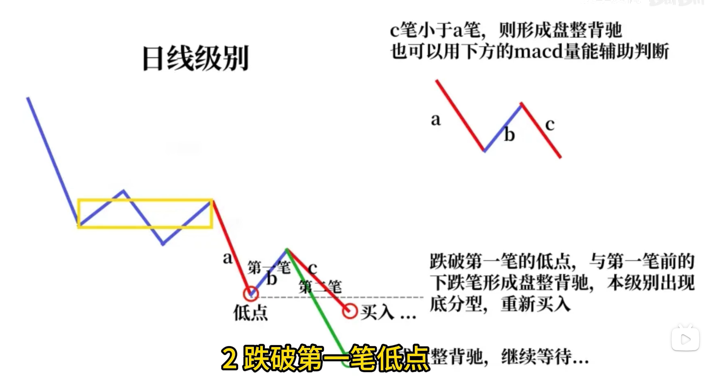

## 如何判断缠论中的二买调整到位

> [!note]  
>
> 1. 二买可以看做一买错过后的买点，也可以看作加仓点位。
> 2. 一个中枢可能不止一个二买，定义为类二买。
> 3. 类二买的意义是突破中枢时往往力度比较大，做打板的成功率较高。

### 二买有三种情况，强度不同

### 一个中枢可能不止一个二买

* 类二买一定要行成一个上涨中枢
* 类二买可以是多个

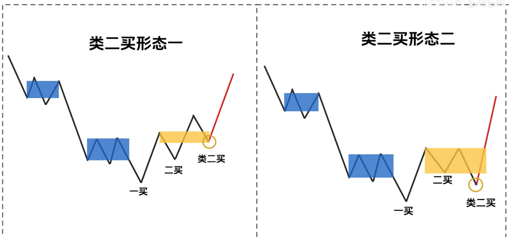

### 类二买出现频率较高的个股类型

* 1,2不需要同时出现

1. 小转大一买
2. 第一类买点后反弹遇到前期下跌中枢的阻力

3. 二三类买点结合的标的

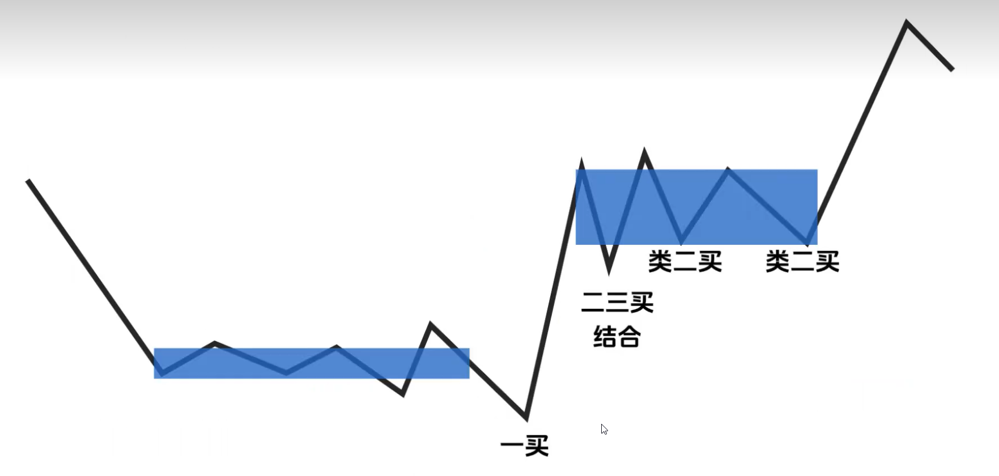

### 如何把握类二买

* 通过区间套

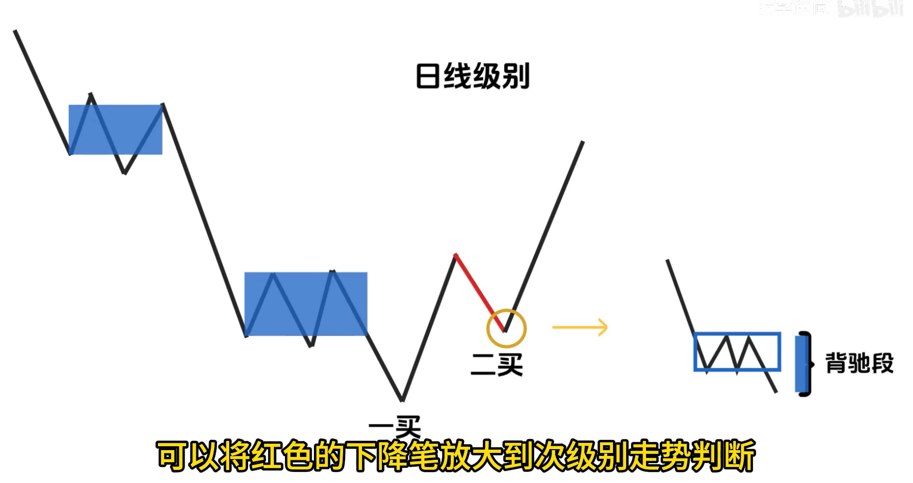

* 在本级别出现底分型后买入

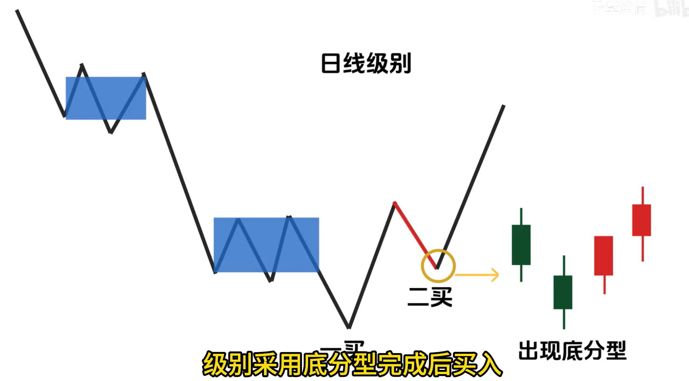

* 如何判断中枢延伸的类二买后的一笔会离开中枢

通常情况下，出现中枢走势时，MACD的快慢线将围绕零轴上下运行，红柱和绿柱长短和面积基本差不多。当出现某一笔下跌行成类二买点位的时候，绿柱和面积明显萎缩，且在类二买点之后的上行过程中，次级别在本级别中枢的上轨附近行成MACD放量的中枢，那么该类二买点铁定离开中枢。

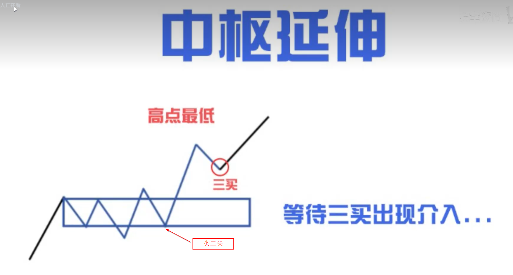

* 类二买止损设置

1. 方法1适合买入位置不高，本级别上涨未成笔，震荡区间窄。
2. 方法2适合本级别已经成笔，震荡区间较宽

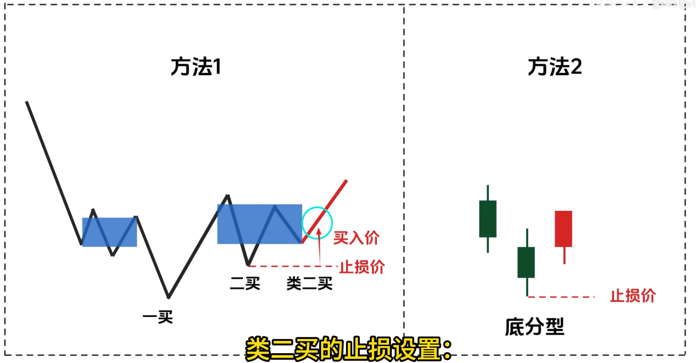

