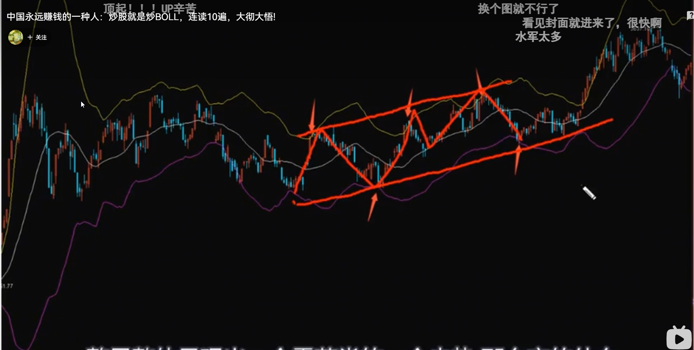
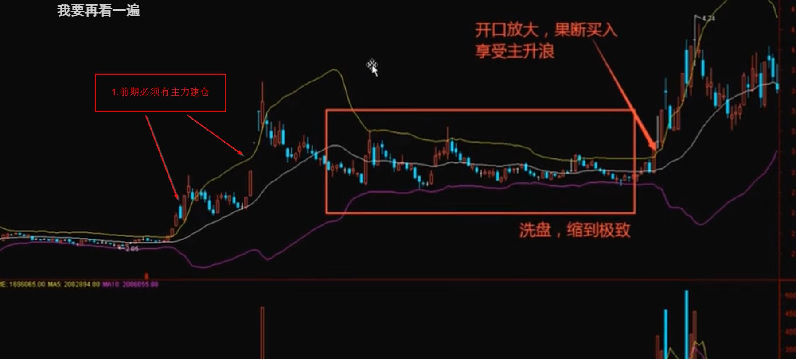

# BOLL交易模型

> [!note]  
>
> BOLL交易的理念是, 通过boll, 结合macd, rsi等指标, 做预期macd日线,周线金叉, 突破震荡区间的一笔. 
>
> 以及主力建仓洗盘后, 回踩中线开启的主升浪.
>
> 策略优点是, 选股思路清晰, 交易思路清晰, 收益稳健. 缺点是收益不如**成功的打板**来的快.

[TOC]

## 一.BOLL基础

[中国永远赚钱的一种人：炒股就是炒BOLL，连读10遍，大彻大悟!]( https://www.bilibili.com/video/BV1vf4y1T7N2/?share_source=copy_web&vd_source=1679980dc710f38d5c49515d0c297073)

### 1.定义

BOLL（布林线）是由约翰·布林（John Bollinger）基于统计学中的**标准差原理**设计的技术分析工具，用于衡量股价波动范围并预测趋势。

* **中轨（MB）**：通常为20日简单移动平均线（SMA），反映中期趋势.
* **上轨（UP）**：中轨加上2倍标准差，代表压力位.
* **下轨（DN）**：中轨减去2倍标准差，代表支撑位.

### 2.形态

BOLL形态分为**通道式, 开口, 缩口**三种.

* **通道式**

**震荡走势**中, 20日收盘价的平均值不会用波动太大,  上下轨之间的距离变化小, 上下轨走平, 指标走出一个通道.

震荡可以是水平的, 也可以是有斜率的.

找到合适的周期, 通道上轨是压力位, 下轨是支撑位, 类似超买和超卖.

**买点:** 下轨.

**卖点:** 上轨.

* **开口**

开口意味着走势有震荡变为趋势, 也就意味着上下轨支撑压力作用大幅降低, 此时应该以中轨为交易信号, 开口后回踩中轨买入.

**买点:** 开口后回踩中轨.

**卖点:** 通过其他指标判断, 上下轨没有意义.

* **缩口**

收口意味着趋势结束, 开始转为震荡走势.

## 二.BOLL高级用法

* 适用于**主力建仓后, 震荡洗盘**(时间换空间)后的主升浪. 如果是暴力洗盘(空间换时间),则不适用.

一招鲜，吃遍天。

高手是怎样利用BOLL不着主升浪的？

主升浪之前一定是建仓和洗盘，洗盘的常见表现就是震荡，而且是振幅逐步萎缩的震荡，使得标准差逐步减少，标准差减少，BOLL指标上下轨的距离减少。

形成极度收口。

之后股价进入主升浪，在进入主升浪前期，标准差急剧增大，预示着股价进入到主升浪阶段，在**BOLL指标刚开口放大突破压力位时**，果断买入，则可以吃到美滋滋的主升浪。

## 三.多周期运用

> [!note]
>
> 以下内容来自AI解答. 个人总结如下:
>
> 1.长周期(周线, 日线)判断趋势, 中轨向上是多头, 中轨向下是空头.
>
> 2.中周期(日线,30分钟)与长周期共振, 长周期多头, 中周期回踩不破中轨为买入点.
>
> 3.短周期(15分钟), 辅助日内交易, 买入用法同上, 止损用法中周期买入, 跌破短周期中轨卖出. 

### **1、BOLL多周期关系解析**

BOLL指标的多周期关联是通过不同时间框架（如日线、周线、分钟线）的协同作用，综合判断趋势强度与买卖时机。核心关系如下：

1. **周期分层与趋势定位**
   - **长周期（如周线、月线）**：反映主趋势方向，例如周线BOLL中轨向上代表中长期多头市场。
   - **中周期（如日线）**：用于判断中短期趋势，捕捉波段交易机会。
   - **短周期（如15分钟线）**：辅助日内交易，例如价格回踩中轨时介入。
2. **共振效应**
    当多个周期的BOLL指标**同步出现信号**时，交易可靠性显著提升：
   - **开口共振**：例如日线和周线布林带同时扩张，预示趋势加速。
   - **支撑/压力重合**：短周期下轨与长周期中轨重叠时，形成强支撑或压力位。
3. **周期收敛与行情启动**
    长期窄幅震荡后，若多个周期布林带同时缩口（即“紧口型喇叭口”），往往预示大行情临近。例如，日线、周线布林带同步缩窄后开口，可能触发单边趋势。

------

### **2、BOLL多周期应用方法**

#### **(1). 趋势协同策略**

- **主趋势判断**：
   以周线BOLL中轨方向为基准，若中轨向上且股价运行于中轨上方，则定义为多头市场，反之为空头。
- **短周期入场**：
   在长周期趋势明确时，利用短周期（如小时线）的BOLL下轨支撑或中轨回踩作为买入点。例如，周线多头趋势下，日线股价回踩中轨且未破位，可视为加仓信号。

#### **(2). 多周期共振交易**

- **突破共振**：
   当股价同时突破多个周期的布林带上轨（如日线、周线同步突破），视为强势买入信号；若同步跌破下轨，则可能开启单边下跌。
- **缩口共振**：
   多周期布林带同步缩口后，若短周期率先开口并伴随成交量放大，可提前布局趋势启动。

#### **(3). 参数优化与组合验证**

- **参数调整**：
   根据市场波动性动态调整周期参数。例如，在震荡市中缩短周期（如N=10），在趋势市中延长周期（如N=30）。
- **指标联动**：
   结合MACD（判断动量）、RSI（识别超买超卖）等指标验证信号。例如，BOLL上轨突破时，若MACD出现金叉，则强化买入信号。

#### **(4). 风险控制要点**

- **假突破防范**：
   多周期共振需配合成交量验证。若价格突破上轨但量能不足，可能为诱多陷阱，需快速止损。
- **止损设置**：
   以共振周期的下轨或中轨作为止损参考。例如，**日线买入后，若跌破15分钟中轨，则触发止损**。

------

### **3、实战案例与进阶技巧**

1. **案例：趋势启动捕捉**
   - **背景**：周线BOLL长期缩口，日线股价窄幅震荡。
   - **信号**：日线突然放量突破上轨，周线同步开口向上。
   - **操作**：在突破日线中轨时介入，止损设于日线下轨。
2. **进阶技巧：周期嵌套分析**
   - 使用“三周期嵌套法”（如240-120-20周期组合），通过长周期定方向、中周期选时机、短周期找点位，提升交易精度。

------

### **总结**

BOLL多周期分析的核心在于**趋势协同与信号共振**，通过长短周期的相互作用过滤噪音，捕捉高概率交易机会。实际应用中需注意：

- 长周期定方向，短周期抓买卖点。
- 共振信号需结合量能与其他指标验证。
- 动态调整参数以适应市场变化。