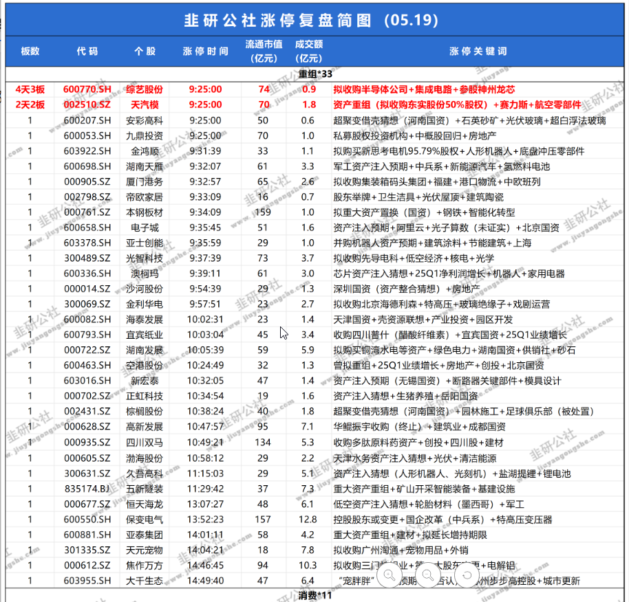

# 题材龙头交易模型

> [!note]
>
> 题材龙头交易模型有两种交易方式.
>
> **第一种**
>
> 根据前一天的涨停, 筛选出强势题材, 强势股, 第二天开盘强度, 选择介入龙一二三.
>
> **第二种**
>
> BOLL开口起爆时介入和BOLL回调中轨不破介入.

[TOC]

## 一.强势题材龙头交易策略

> [!note]
>
> 此策略需要注意, 龙一涨停股强度, 如果强度不够, 继续观察等午盘入龙一, 龙二, 够强才追龙二, 龙三.  
>
> 也要注意观察当前高度, 宁愿错过等回调, 也切记勿追高.

**优点: **观察方法最为简单, 操作需要果断, 强势股很难给第二次机会. 

**缺点:** 容易追高, 没有先手时, 心情容易急躁而追高.

### 1.交易方法

(1).根据[韭研公社异动](https://www.jiuyangongshe.com/action)复盘, 选出涨停最多的最强题材, 将前3个股票加入自选.

(2).第二天开盘, 比较题材中涨停最多的股, 认定最强题材.

(3).买入方法: 按龙一, 龙二, 龙三顺序, 买入有机会介入的股票. 题材强势, 诱空开盘的按开盘下往下2到4个点买入.

(4).卖出方法: 竞价走弱, 不要贪心, 一定清仓. 如果竞价最后一笔有诱多, 开盘往上2个点卖出, 如果没有诱多, 直接止盈或止损. 

### 2.实例讲解

**(1).5月19日复盘**

重组涨停股最多, 前3强为综艺股份, 天汽模, 安彩高科, 九鼎投资.

5月20日综艺股份, 天汽模, 安彩高科涨停开, 九鼎投资涨停后回落, 若此时介入, 当天涨停.

5月21日九鼎投资竞价走弱, 应该找机会出售. 竞价最后一笔诱多, 有冲高可能, 冲高2个点后立即清仓, 这一波可以赚至少3个点.   

## 二.热点题材周线MACD起爆及BOLL回踩交易策略

参考<<BOLL交易模型>>.

第一次介入机会: 筛选出周线MACD即将金叉的股票, 在日线低轨超卖时介入, 或者上穿BOLL中轨介入. 

第二次介入机会: 在周线开口, 日线回调不破中轨, 题材有持续性利好时介入.