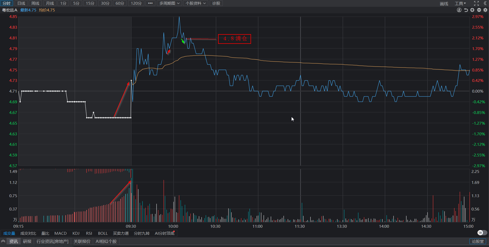

# 做T粤宏远, 清仓中科金财

## 一、持股复盘

### 1.粤宏远A

* **今日操作**

  开盘竞价强转弱，清仓。

  尾盘竞价买入。
* **明日预期**

  1分钟站上60日均线（4.74）。日线仍有上升预期。
* **非预期**

  开盘走弱，低开或者反弹1分钟无法站上60日均线。

### 2.中科金财

* **今日操作**

  开盘走弱，但承接很强，预期分歧。

  盘中未跌破5分钟前中枢，持续观察，冲高未及时卖出复盘图。

  尾盘竞价卖出。
* **明日预期**

  日线仍有沿5日均线向上预期。
* **非预期**

  30分钟向下回补下方缺口。
* **复盘分析**

  1图为实际走势，震荡后突破前高，延续上涨走势。

  2图为1图的上涨终结假设。

  <b>
    3图为实际走势，第3笔下跌跌破前低，回调形态中上升走势终结，因此2图上升走势终结，应反弹到前低附近时卖出。

  也可以再观察一笔，第4笔跌破盘整低点，更确定2图上升走势终结。
 **

  4图/5图向上突破中枢，延续2图向上的趋势。

### 3.华联控股

* **今日操作**

  无操作。

  集合竞价最终走弱，应开盘清仓。
* **明日预期**

  已至30分钟中枢下沿，反弹到上沿4.27。
* **非预期**

  跌破30分钟中枢。

### 4.金奥博

* **今日操作**

  无操作。

  1分钟可以做T复盘图。
* **明日预期**

  已跌破5分钟向上中枢，5分钟反弹到中枢，观察是否受30分钟60均线压制。
* **非预期**

  下跌或反弹到5分钟中枢下沿后无力。
* **复盘分析**

## 新股观察

### 1.长白山

* **原因**

  技术形态好 + 旅游季 + 提振消费。
* **明日预期**

  30分钟回调至20均线后延续上升走势。
* **非预期**

  30分钟跌破20均线，往60均线。

### 2.深圳华强

* **原因**

  技术形态好 + x90芯片
* **明日预期**

  不回补日线缺口，沿30分钟20均线上涨。

  或回补日线缺口，沿日线5均线上涨。
* **非预期**

  跌破前低。
