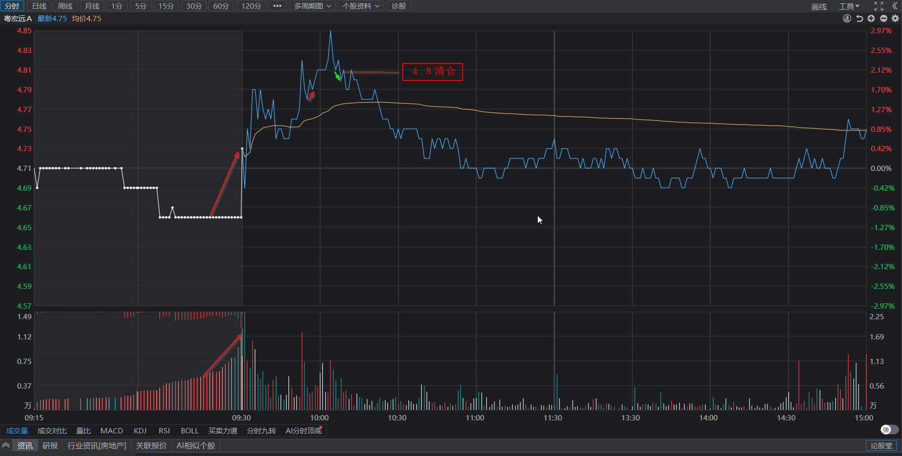

# 失败与成功并存

## 2025-03-03 星期一

### 当前持仓

- **拓维信息**

    - **买入回顾**  
30分钟macd即将反转，待macd变红后，观察30分钟滞涨，结合5/1分钟顶背离卖出。

    - **今日操作**  
没有按计划卖出。交易失败

- **凯众股份**

    - **买入回顾**
30分钟macd即将反转，待macd变红后，观察30分钟滞涨，结合5/1分钟顶背离卖出。  
   
    - **今日操作**
没有按计划卖出。交易失败

### 交易总结
- **买入股票**:
  - 股票1 (代码) - 买入价: 价格  
  - 股票2 (代码) - 买入价: 价格

- **卖出股票**:
  - 股票1 (代码) - 卖出价: 价格
  - 股票2 (代码) - 卖出价: 价格

### 复盘总结
- **今日操作总结**:
  - 总结1: 描述
  - 总结2: 描述

- **明日计划**:
  - 计划1: 描述
  - 计划2: 描述

### 备注
- 备注1: 描述
- 备注2: 描述