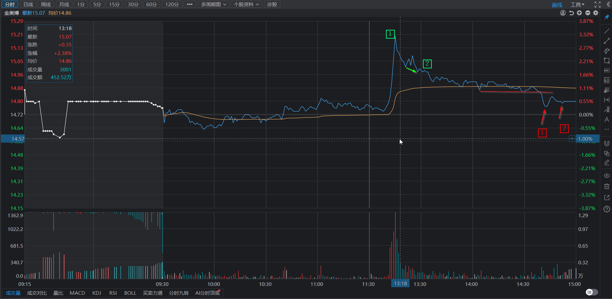

# 低开后无所适从大跌吃面

> [!Note]
> 1.周四对行情判断有问题，未分析大盘及个股对应板块。  
> 2.止盈/止损计划不明确，尤其非预期低开开盘后无所适从。

## 一、大盘分析

> **当前走势**

xxxxx

> **预期走法及应对**

**1.创新高**

创新高后，顶背离。

创新高后，不顶背离。

**2.盘整不创新高**

不创新高，进入盘整。

## 二、持股复盘

### 1.深圳华强

> **今日操作**

  符合预期，5日均线止跌。当日最低价挂单未成交，匆忙在略高处抢筹。    
  华为发布会，公布5月份发布鸿蒙PC。  
  

> **明日预期**

  当前处于30分钟一笔下跌，日线处于5日均线附近。  
  预期不破5日线，缺口不完全回补。

> **非预期**

  补全缺口。

> **复盘分析**

  通过5分钟笔的底背离判断30分钟一笔下跌结束，应等待背离的一笔形成底分型后，1买买入。今日挂单最低价未买入后，略微心急，到收盘尚未形成底分型。

### 2.华联控股

> **今日操作**

  无操作。  
  
> **明日预期**

  仍处于30分钟中枢下沿，反弹到上沿4.27。

> **非预期**

  跌破30分钟中枢。

### 3.金奥博

> **今日操作**

  在分时线中枢加仓，未等跌破中枢后止跌。  

> **明日预期**

  目前处于5分钟一笔下跌。预期5分钟宽幅震荡，不破下沿。

> **非预期**

  跌破30分钟中枢。

> **复盘分析**  

  冲高后懵逼了，起了贪心。向上一笔结束后，应立即卖出，做T。  
  加仓点应该等跌破中枢，形成背离后加仓。

